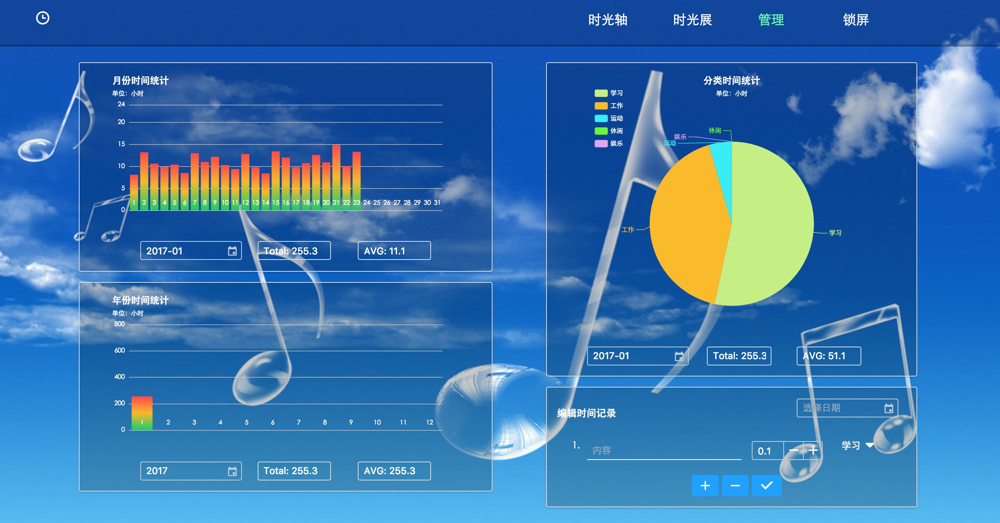
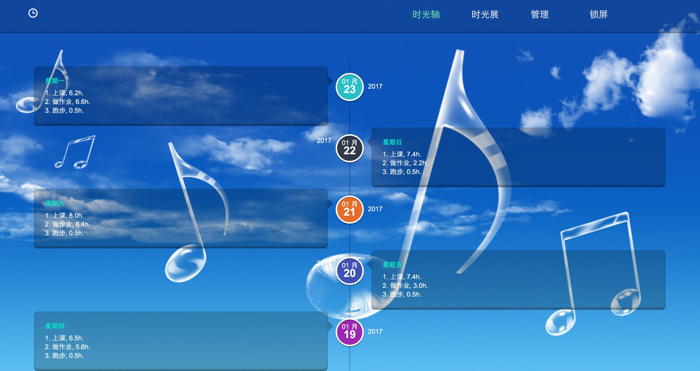

# Timeline-X

> A Simple Timeline Application. SPA. Powered By Vue/Vue-router/Vuex.

## 一、项目构建启动

``` bash
# 安装依赖
npm install

# 生成伪数据（开发用）
npm run fake-data

# 前端开发，localhost:8080
# 前端已经完成跟后端对接，启动开发模式之前需要把/src/store/action.js相应的代码解注释或者注释
npm run dev

# 构建最终产品
npm run build

# 后端开发，localhost:8080
# 启动后端之前需要先完成构建得到前端的资源
# 验证密码为"hongchh"，可以在/server/controller/index.js里面修改密码
# 应用比较简单故没有使用到数据库，所有数据都为文件存储，项目主要关注前端开发
npm back-end
```

## 二、成品展示





## 三、基本需求
### 1、时间记录
* 添加每一天的时间记录，修改某天的时间记录（因为可能记错或者忘了记某项活动）
* 每天的记录可以有多项活动，每项活动有对应的时间
* 每项活动划分到特定的类型

```txt
2016-01-20，星期五
1. 学习Vue, 5h，[学习]
2. 跑步，0.5h，[运动]
3. 看霹雳布袋戏，2h，[休闲]
```

### 2、数据分析
* 按照月份统计每天的总时间，按照年份统计每月的总时间，按照分类统计各项内容的总时间
* 以图表形式展示月份时间支出和年份时间支出的变化情况
* 以图表形式展示各种类型的活动的时间支出情况
* 计算总时间和平均时间

### 3、时光展示
* 时光轴形式进行活动记录展示，便于回顾总结
* 轮播图形式进行活动记录展示，便于回顾总结

### 4、数据模型
```json
{
  "items": [{
    "content": "string",
    "time": "number",
    "type": "string"
  }],
  "year": "number",
  "month": "number",
  "date": "number",
  "day": "number"
}
```

数据项示例
```json
{
  "items": [{
    "content": "学习Vue",
    "time": "5",
    "type": "学习"
  }, {
    "content": "跑步",
    "time": "0.5",
    "type": "运动"
  }, {
    "content": "看霹雳布袋戏",
    "time": "2",
    "type": "休闲"
  }],
  "year": "2016",
  "month": "01",
  "date": "20",
  "day": "5"
}
```

## 四、开发思路
### 1、界面构成
* 整个应用分成2个主要界面：【主界面】，【权限界面】
* 【权限界面】用于用户登录，也是应用的启动界面
* 【主界面】包含3个子界面：【管理】，【时光轴】，【时光展】
* 【时光轴】和【时光展】用于时光展示
* 【管理】用于展示数据分析结果以及编辑时光记录（添加/修改）

### 2、跳转关系
* 【权限界面】验证成功之后跳转到【主界面】
* 【主界面】默认展示【时光轴】界面
* 【主界面】顶栏可以选择跳转到【管理】、【时光轴】或【时光展】界面
* 【主界面】顶栏选择“锁屏”之后回到【权限界面】

### 3、组件划分
```txt
└─App：挂载整个应用
   ├─Auth：【权限界面】
   │  └─StarFlow：【权限界面】底部的动画
   └─Main：【主界面】的基本结构
      ├─Management：【管理】
      │     ├─TimeAnalysisPerMonth：月份时间分析组件
      │     ├─TimeAnalysisPerYear：年份时间分析组件
      │     ├─TimeAnalysisByType：分类时间分析组件
      │     └─EditTimeRecord：时间记录编辑组件
      ├─Timeline：【时光轴】
      └─TimeSlide：【时光展】
```

### 4、文件结构
```txt
└─build：构建用到的相关文件
├─config：构建的配置文件
├─server：应用的服务器源码
│   ├─controller：服务端业务逻辑
│   ├─model：数据存储逻辑
│   ├─static：静态文件
│   ├─views：应用的视图文件
│   ├─app.js：express服务器配置文件
│   └─server.js：服务器启动文件
├─src：前端开发源码
│   ├─assets：图片等静态资源
│   ├─components：前端组件
│   ├─router：前端路由
│   ├─store：vuex的store
│   ├─App.vue：应用的外层结构
│   └─entry.js：应用的入口文件
└─static：前端开发过程中用到的静态文件
    └─data：存放伪数据以及伪数据生成器
```
